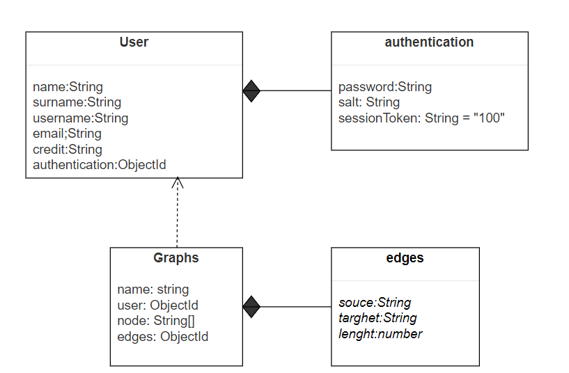

L'obiettivo del progetto è quello di calcolare il cammino minimo tra un nodo di partenza e uno di arrivo,specificati dall'utente, utilizzando l'algoritmo di Dijkstra.
Il sistema consente di gestire la creazione,valutazione e modifica di modelli di ottimizzazione su grafo.
L'utente ha la possibilità di creare un suo modello a cui viene addebitato un numero di Token, assegnatogli inizialmente, in base al numero di nodi e archi creati.Il modello viene creato solamente se il credito dell'utente è sufficiente alla creazione. 
Viene data la possibilità di modificare il modello andando ad aggiornare il numero di pesi degli archi. La richiesta di modifica viene gestita in maniera tale che se l'utente, che ha richiesto la modifica, è il "proprietario" del modello, l'utente può procedere all'aggiornamento dei pesi se la richesta è considerata valida. Altrimenti, se l'utente non coincide con l'utente "proprietario", la richiesta deve essere approvata dall'utente che ha creato il modello. La modifica del modello, come per la creazione, è soggetta alla riduzione del numero di Token in base al numero di pesi che sono stati modificati.

Descrizione dei pattern.

Per mantenere il progetto organizzato facilitandone la navigazione, il codice è stato suddiviso in due macro cartelle:
1. Node-modules: contiene tutti i moduli e le dipendenze esterne utilizzate nel progetto. Questo rende più facile gestire le versioni delle dipendenze.
2. src (souce): continete il codice sorgente effettivo del progetto. Qui sono stati inseriti i file in typescript per implementare la logica del progetto. il codice sorgente è stato a sua volta organizzato in sottocartelle (controllers,db,heleprs,middlewares, router) all'interno di "src" a seconda della sua funzionalità.
	
 2a. controllers/authentication.ts
	Questo codice include due funzioni di controllo per la gestione del login e della registrazione degli utenti. 
	Qui vengono utilizzati alcuni pattern comuni nel contesto di sviluppo web:
	. Il pattern di importazione viene utilizzato per importare i moduli necessari e le funzioni specifiche dai moduli.
	. Il pattern di gestione degli errori viene utilizzato per gestire gli errori durante la registrazione e il login degli utenti.
	. Il pattern di validazione viene utilizzato per verificare se le informazioni richieste (email, password, username) sono fornite correttamente e se un utente con l'email 	fornita esiste già.
	. Il pattern di autenticazione viene utilizzato per verificare la correttezza delle credenziali fornite durante il login e per generare un token di sessione per l'autenticazione dell'utente.
	. Il pattern CRUD (Create, Read, Update, Delete) viene utilizzato per creare un nuovo utente nel database durante la registrazione e per ottenere un utente dal 	database durante il login.

 2b. controllers/graphs.ts
	Questo codice definisce un insieme di controller che gestiscono le richieste relative ad un grafo. Qui non vengono utilizzati pattern specifici, ma il codice include delle pratiche 	di organizzazione e 
  leggibilità:
	. Separazione delle responsabilità: Il codice è organizzato in diverse funzioni che gestiscono le richieste HTTP e richiamano il servizio appropriato per eseguire le operazioni 	sul database.
	. Utilizzo di async/await: Le funzioni sono definite come async e utilizzano await per gestire le operazioni asincrone in modo conciso e leggibile.
	. Gestione degli errori: Le eccezioni lanciate durante le operazioni di database sono catturate e gestite per restituire una risposta adeguata con lo stato HTTP corretto e un 	messaggio di errore descrittivo.

	2c. db/graphs.ts
	Il codice definisce uno schema per un documento di un grafo nel database MongoDB utilizzando Mongoose. I pattern utilizzati all'interno di questo frammento di codice sono:
	. ORM(Object Relational Mapping) fornito da Mongoose per mappare gli oggetti JavaScript ai documenti nel database MongoDB, è stato utilizzato per semplificare la gestione dei dati 	senza la necessità di 
    scrivere query SQL manualmente, inoltre rende più semplice l'interazione con il database.
	. Promises, per gestire le operazioni asincrone. Sono state utilizzate per miglirare la gestione dell'errore e la scrittura del codice.
	. Popolazione: il pattern di popolazione viene utilizzato per popolare il campo "user" nell'oggetto del grafo con l'oggetto corrispondente dalla collezione "User". Ciò semplifica l'accesso e l'utilizzo dei dati 
    correlati, riducendo la necessità di eseguire query aggiuntive o di complicare ulteriormente il codice.

	2d. db/users.ts
	Questo codice definisce uno schema per il modello "User" utilizzando Mongoose, un modulo di ODM per MongoDB. Inoltre, vengono definite diverse operazioni CRUD per il modello "User".
	I pattern definiti all'interno di questo codice sono:
	. Modularità: Il codice è organizzato in moduli separati in base alle operazioni CRUD associate al modello User, in modo da semplificare lo sviluppo e la gestione del codice. Ogni operazione ha una funzione 
    associata che può essere esportata ed utilizzata altrove nel codice.
  . Schema: Viene definito uno schema per il modello User utilizzando la libreria mongoose. Lo schema definisce i campi e il tipo di dati che devono essere presenti nel documento User.la definizione dello schema 
    per il modello User garantisce che i documenti che verranno inseriti nel database rispettino una struttura predefinita. Questo permette di avere un maggiore controllo sulla validità dei dati e facilita la 
    gestione e l'interrogazione dei dati all'interno del database.
  . Utilizzo dei metodi del modello: Vengono utilizzati i metodi forniti dal modello User per eseguire operazioni come la ricerca di utenti, la creazione di nuovi utenti e 	l'aggiornamento o cancellazione di 
    utenti esistenti. l'utilizzo dei metodi del modello User semplificano l'interazione con il database.
	. Parametri: Le funzioni che eseguono operazioni di ricerca prendono dei parametri come input per filtrare i risultati. Questi parametri sono solitamente stringhe che corrispondono a 	campi specifici nel 
    documento User. I parametri rendono flessibile l'interrogazione dei dati e permettono di ottenere risultati più precisi.

	2e. helpers/index.ts
	. Costante pattern: È presente la dichiarazione della costante `SECRET` utilizzata come chiave segreta per le operazioni crittografiche. Questo rende il codice più sicuro.
	. Funzione pattern: Ci sono due funzioni definite utilizzando la sintassi `export const. Consente di esportare le funzioni per poterle utilizzare in altri moduli. Ciò viene fatto 	per poter riutilizzare le 
  funzioni in più parti del programma o in altri moduli.

	2f. Middleware 
	Questo codice definisce una middleware function chiamata "isAuthenticated" che viene utilizzata per verificare l'autenticazione di un utente. 
	nel codice sono stati utilizzati diversi Pattern:
	. Modulo di importazione predefinito: import express from 'express';
	  Questo pattern importa tutto il modulo di express come un oggetto predefinito. E' stato utilizzato per permettere di usare tutte le funzionalità del modulo senza dover specificare 	un nome specifico per ogni 
    funzione o variabile.
	. Destrutturazione: import { get, merge } from 'lodash';
	  Questo pattern importa solo le funzioni get e merge dal modulo di lodash, anziché tutto il modulo. Viene utilizzato per permettere di imporatre solo pe parti necessarie del modulo, 	riducendo la quantità di 
    codice.
  . Alias degli import: import { getUserBySessionToken } from '../db/users';
	  Questo pattern importa la funzione getUserBySessionToken dal modulo ../db/users e gli dà un nome diverso. Questa scelta è stata fatta per rendere il codice più comprensibile.

	2g. index.js
	Il codice importa i moduli e le librerie necessarie per creare un'applicazione Express. Viene creata un'istanza dell'applicazione Express, si configurano alcuni middleware come il 	parsing del body delle 
  richieste JSON e la gestione dei cookie. Viene creato un server HTTP utilizzando l'applicazione Express e viene avviato il server sulla porta 8080. Viene 	istanziato un client MongoDB e viene gestita la 
  connessione al database. Infine, viene utilizzato un router per gestire le richieste ai diversi percorsi dell'applicazione Express.
	Non ci sono pattern specifici nel codice, ma sono utilizzati pattern comuni come l'importazione dei moduli, la configurazione dei middleware, l'avvio del server e la 	gestione 	delle connessioni a MongoDB.
