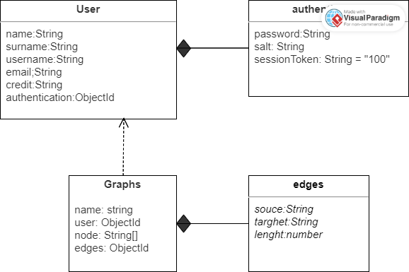

L'obiettivo del progetto è quello di calcolare il cammino minimo tra un nodo di partenza e uno di arrivo,specificati dall'utente, utilizzando l'algoritmo di Dijkstra.
Il sistema consente di gestire la creazione,valutazione e modifica di modelli di ottimizzazione su grafo.
L'utente ha la possibilità di creare un suo modello a cui viene addebitato un numero di Token, assegnatogli inizialmente, in base al numero di nodi e archi creati.Il modello viene creato solamente se il credito dell'utente è sufficiente alla creazione. 
Viene data la possibilità di modificare il modello andando ad aggiornare il numero di pesi degli archi. La richiesta di modifica viene gestita in maniera tale che se l'utente, che ha richiesto la modifica, è il "proprietario" del modello, l'utente può procedere all'aggiornamento dei pesi se la richesta è considerata valida. Altrimenti, se l'utente non coincide con l'utente "proprietario", la richiesta deve essere approvata dall'utente che ha creato il modello. La modifica del modello, come per la creazione, è soggetta alla riduzione del numero di Token in base al numero di pesi che sono stati modificati.

UML 

